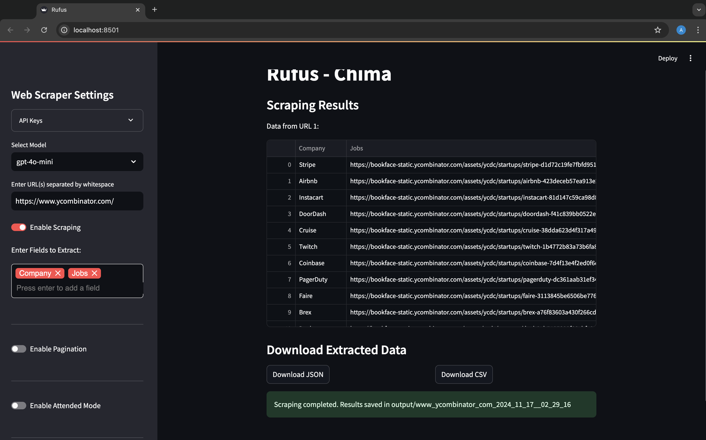

# AI Scraper

AI-Scraper is an intelligent web data extraction tool designed specifically for Retrieval-Augmented Generation (RAG) agents. In the complex landscape of web data collection, Rufus solves the critical challenge of retrieving meaningful and structured information from websites for AI and machine learning applications.
Traditional web scraping tools often fall short when dealing with complex website structures, nested pages, and dynamically loaded content. Rufus revolutionizes this process by providing an AI-powered solution that intelligently crawls websites, selectively extracts relevant information, and synthesizes it into clean, structured documents ready for immediate use in LLM (Large Language Model) pipelines.




# **Key Features**

RufusV2 comes with a wide range of features that cater to a diverse set of users. Here are some of the key features:

- **Intelligent Web Crawling**: Dynamically navigate websites based on user-defined prompts, handling complex link structures and nested pages with advanced AI-driven link selection.
- **Selective Content Extraction**: Focus on retrieving only the most relevant information based on specific user instructions, eliminating noise and irrelevant data.
- **AI-Powered Document Synthesis**: Transform raw web content into structured, clean documents in formats like JSON and CSV, optimized for immediate integration with RAG systems.
- **Robust Error Handling**: Gracefully manage challenges like inaccessible pages, changing website structures, and dynamic content loading and utilizes multithreading, allowing simultaneous 
- **Pagination**: Rufus can also intelligently handle pagination you can link the number of pages you want to scrape
- **Multiple LLMs**: Rufus now has option to choose between multiple LLMs, Open AI family, xAI, Google's-Gemini through the interactive streamlit web application
- **Costing**: With incorporation of multiple LLM choices (OpenAI, Google-Gemini, Grok) user can now see the overall price of scrapping a page based on the model they selected. 
crawling.
- **Unit Test**: I've also included unit test for all the components in the RufusClient to test out new features/addition in future.

## Setup Instructions

1. **Clone the Repository:**

    ```bash
    git clone https://github.com/pupscub/Rufus-Chima.git
    ```

2. **Set Up Virtual Environment:**

    ```bash
    python3 -m venv venv
    source venv/bin/activate  # For Windows use: venv\Scripts\activate
    ```

3. **Install Dependencies:**

    ```bash
    pip install -r requirements.txt
    ```

4. **Configure your OpenAI API Key:**

    - Create a `.env` file in the root directory.
    - Add your OpenAI API key:

      ```plaintext
      OPENAI_API_KEY=your_openai_api_key_here
      ```

## Usage Example

## Launching the Application

To run RufusClientV2, navigate to the project directory and run the following command:

```bash
cd RufusClientV2
streamlit run app.py
```


## Usage
After launching the application, open your web browser to the indicated address (typically http://localhost:8501). Use the sidebar to input the URL and fields you wish to scrape, then click the "Scrape" button to see results.

You can also paste your OpenAI API Key, Google Gemini API key, etc. through streamlit application
The outputs will be stored in `Output` folder of in `RufusV2` folder.

### Using RufusClient Directly

```bash
cd RufusClient
python RufusTest.py
```


```python
# RufusTest.py
from RufusClient.client import RufusClient
import json

def main():
    print("Welcome to RufusClient!")
    url = input("Enter the URL you want to scrape: ") # enter the URL you want to scrape and know about
    instructions = input("Please enter the prompt: ") # enter the prompt (sections you want to emphasize on)
    client = RufusClient(user_prompt=instructions)
    documents = client.scrape(url)
    print(json.dumps(documents, indent=4))

if __name__ == "__main__":
    main()
```

## Testing

```bash
python -m unittest discover -s tests -p "test_rufus.py"
python -m unittest discover -s tests -p "test_parser.py"
python -m unittest discover -s tests -p "test_crawler.py"
```

### Future work on Rufus:
- Add capabilities to fetch and donwload complex nested links
- give more robust output maybe in CSVs
- give an option to switch between different LLM API's i.e make the code dynamic to choose which LLM user wants to use eg. Llama family, Anthropic, OpenAI etc.  
